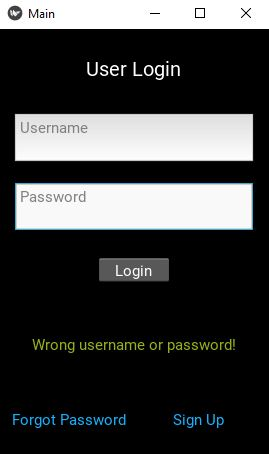
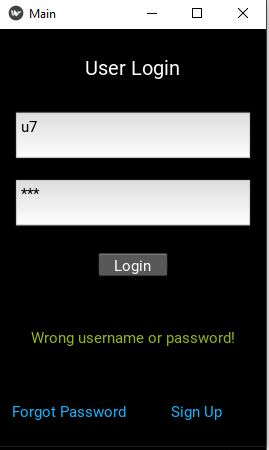

# Feel-Good-Mobile-App
Sample output :arrow_down:  
###### Login Screens

###### Sign up Screens

###### Display text:

###### If the user is sad, the app will try to make them happy by giving a quote that is relevant to their state of emotions.

