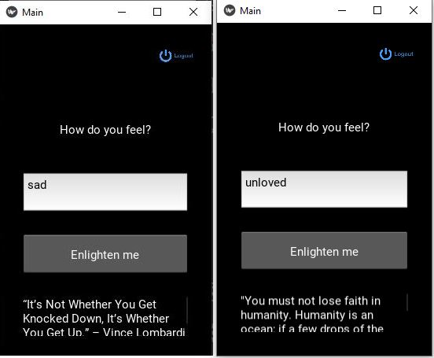

# Feel-Good-Mobile-App
Sample output :arrow_down:  
###### Login screens

###### Sign up screens

###### Hover button

###### Display text: If the user is sad/unloved, the app will try to make them happy by giving a quote that is relevant to their state of emotions.

