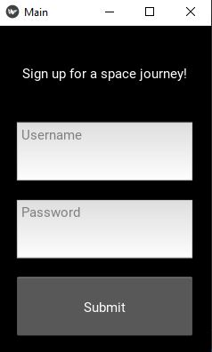

# Feel-Good-Mobile-App
Sample output :arrow_down:  
###### Login Screen

###### Login Success Screen

###### Sign up Screen

###### Display text:
###### If the user is sad, the app will try to make them happy by giving a quote that is relevant to their state of emotions.

